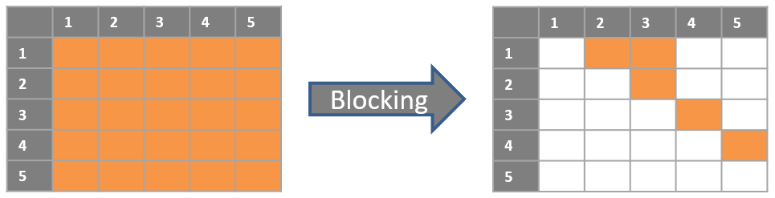
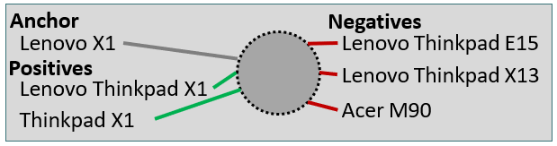

# ACM Sigmod Programming Contest - Team WBSG

This repository contains code and [relevant instructions to reproduce our final submission](#execution) for the [ACM Sigmod Programming Contest 2022](http://sigmod2022contest.eastus.cloudapp.azure.com/index.shtml).

## Task Overview

The goal of the Programming Contest was to develop a blocking system for Entity Resolution. Entity Resolution (ER) is the problem of identifying and matching different tuples that refer to the same real-world entity in a dataset, such as tuples Georgia Tech and Georgia Institute of Technology. When performing ER on a table A, considering all quadratic number (A x A) of tuple pairs can be computationally expensive. Thus, a filtering step, referred to as blocking step, is used first to quickly filter out obvious non-matches and to obtain a much smaller candidate set of tuple pairs, for which a matching step can then be applied to find matches.

For this task, the teams were asked to perform blocking on the two [product datasets D1 and D2](http://sigmod2022contest.eastus.cloudapp.azure.com/task.shtml?content=datasets), each one containing different types of products with different distributions of data and noise. The challenge was to design a blocking system for each dataset that can quickly filter out non-matches in a limited time to generate a small candidate set with high recall (not losing too many true matches).

## Solution Overview

The WBSG blocking system applies a mixture of modern neural and traditional symbolic blocking techniques. One of the main challenges for the blocking system was the restriction on computational power imposed by the organizers of the contest, as all submissions were evaluated using a CPU-only machine with 16 cores and 32GB RAM and had to finish within 35 minutes. Implementing a neural approach using Transformers given these restrictions is challenging. We overcame this challenge by using an [extremely small distilled Transformer](https://huggingface.co/microsoft/xtremedistil-l6-h256-uncased) in combination with an approximate nearest neighbour search using [Facebook's FAISS library](https://github.com/facebookresearch/faiss) as presented by Johnson et al. in their paper [Billion-scale similarity search with GPUs](https://ieeexplore.ieee.org/abstract/document/8733051).

Our blocking system performs 6 steps. In the first step, domain-specific preprocessing is applied to normalize the record texts. The record text is represented by the values of the attributes title (D1) and name (D2). All unique record texts are embedded using task-specific fine-tuned Transformer models and the embeddings are indexed using FAISS during steps two and three. An approximate nearest neighbour search for all record texts over the FAISS indexes is executed in step four. The output of step four is a ranked list of candidate group pairs. This ranked list of group pairs is re-ranked using the average similarity score of the cosine similarity and the Jaccard similarity of the candidate group pairs in step five. The re-ranking smoothes the bias of the embedding model. In the sixth step, the final record pairs are generated by combining records from the most similar candidate group pairs until the amount of 1 million tuple pairs for D1 and 2 million tuples pairs for D2 is created. The amount of pairs was restricted by the organizers of the contest.

The key step of the whole blocking system is the third step during which the unique record texts are embedded. For the embedding, the [xtremedistil-l6-h256-uncased transformer model](https://huggingface.co/microsoft/xtremedistil-l6-h256-uncased) proposed by Mukherjee et al. in the paper [XtremeDistilTransformers: Task Transfer for Task-agnostic Distillation](https://arxiv.org/abs/2106.04563) is used. For performance reasons, the maximum sequence length of the tokenizer, which is used to encode the record texts, is limited to 28 and 24 tokens for the datasets D1 and D2. Additionally, the model is forced to focus on the most important features of the model output through a simple feed-forward layer that projects the 256 dimensions of the transformer model’s output to 32 dimensions. This architecture is visualized by the figure on the right.

The transformer model is trained using the architecture presented by Peeters and Bizer in the paper [Supervised Contrastive Learning for Product Matching](https://arxiv.org/pdf/2202.02098.pdf), which itself uses a supervised contrastive loss function presented by Khosla et al. in the paper [Supervised Contrastive Learning](https://proceedings.neurips.cc/paper/2020/hash/d89a66c7c80a29b1bdbab0f2a1a94af8-Abstract.html). As following figure visualizes the concept of supervised contrastive learning.

In addition to the training data provided by the challenge organisers, the model is pre-trained using [a large set of product offers](https://github.com/wbsg-uni-mannheim/productbert-intermediate), which were extracted from the Common Crawl by relying on schema.org annotations. The offers in this pre-training set are grouped by product IDs and belong to the product category “Computers and Accessories”. The offers were already used for the intermediate training for the experiments documented in [Intermediate Training of BERT for Product Matching](http://ceur-ws.org/Vol-2726/paper1.pdf).

## Execution

### Blocking System

* **Requirements**

    [Pip](https://pypi.org/project/pip/) or [Anaconda3](https://www.anaconda.com/products/individual)

* **Building the python environment using pip**

    To build the python environment used for the submissions, navigate to the project root folder where the file *requirements.txt* is located and run `pip3 install -r requirements.txt`.

* **Reproducing our final submission**

    To reproduce our final submission, please run `python3 blocking_neural.py` in the root folder.
    The script produces the requested `output.csv`, which is used for the evaluation of the blocking system.

    
### (Optional) Training the contrastive model

The checkpoints of the trained models are included in this repository in the `models/` folder. It is not necessary to rerun the training for the blocking system to work. If you specifically want to replicate the training, follow these steps:

* **Requirements**

    [Anaconda3](https://www.anaconda.com/products/individual)

* **Building the conda environment**

    To build the conda environment used for the challenge, navigate to the project root folder where the file *sigmod.yml* is located and run `conda env create -f sigmod.yml`

* **Install project as package**

	You need to install the project as a package. To do this, activate the environment with `conda activate sigmod`, navigate to the root folder of the project, and run `pip install -e .`

* **Downloading the raw data files**

    Navigate to the `src/data/` folder and run `python download_datasets.py` to automatically download the needed additional files into the correct locations.
    You can find the data at `data/raw/`

* **Processing the data**

    To prepare the data for the experiments, run the following scripts in that order. Make sure to navigate to the respective folders first.
    
    1. `src/processing/preprocess_corpus.py`
    2. `src/processing/preprocess_sigmod.py`

* **Running the contrastive pre-training**

    Navigate to `src/contrastive/`
	
	Run the following scripts to replicate the models trained for the challenge datasets:
	
	X1: `bash sigmod1/run_pretraining_with_additional.sh microsoft/xtremedistil-l6-h256-uncased False 1024 1e-04 0.07 200 computers_only_new_15_train_sigmod_28 GPU_ID`

	X2: `bash sigmod2/run_pretraining_with_additional.sh microsoft/xtremedistil-l6-h256-uncased False 1024 5e-04 0.07 200 computers_only_new_15_train_sigmod_24 GPU_ID`
	
	You can then find the trained models in the folder `reports/`
